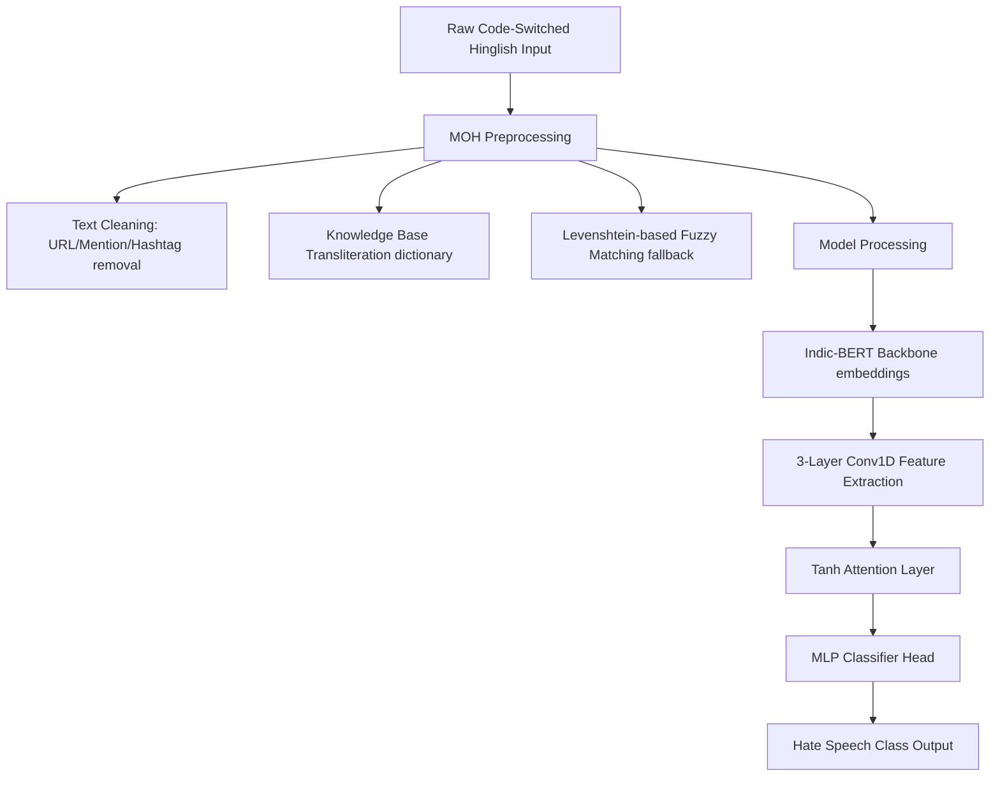

# Deep Learning-Based Hate Speech Detection in Hindi-English Code-Switched Language

This repository contains the code and dataset for a research-grade framework designed to detect hate speech in **Hindi-English (Hinglish) Code-Switched** social media texts. Due to the massive lexical variations, non-standard spelling structures, and lack of standardized grammar rules in code-switched languages, traditional NLP models fail. 

This project solves this by using a hybrid pipeline that combines a multilingual pre-trained transformer model (**Indic-BERT**) with a **3-Layer Conv1D feature extractor** and a **Tanh Attention mechanism**, preceded by a custom **MOH (Model-ready / Knowledge-based Transliteration and Cleaning)** preprocessing system.

---

## 🚀 Key Achievements
- **Hate Speech Dataset (Binary):** Achieved an **F1-score of 0.9171** and **91.72% Accuracy** (Epoch 18).
- **HASOC Dataset (Binary):** Achieved an **F1-score of 0.9147** and **91.47% Accuracy** (Epoch 40).
- Outperformed all baseline baseline implementations (Raw IndicBERT, XLM-RoBERTa, and DistilBERT).

---

## 🏗️ System Architecture

The pipeline consists of two main stages: Preprocessing (MOH) and Model Training (Enhanced Indic-BERT + CNN + Attention).



### 1. Data Preprocessing with MOH
Hinglish text contains substantial noise and dialectal spellings (e.g., `pyaar`, `pyar`, `pyarrr`). The preprocessing pipeline handles this through:
- **Cleanups:** URL removal, mention stripping (`@username`), hashtag removal, and compression of character repetitions (e.g., `haaaate` $\rightarrow$ `haate`).
- **Knowledge-Base (KB) Mapping:** Directly maps common Hinglish slang and terminology from a domain-specific dictionary (`KB_Dict.txt`).
- **Fuzzy Levenshtein Fallback:** If a code-switched word is missing from the dictionary, a Levenshtein distance ratio check ($> 0.70$) is executed against known KB keys to find and assign the closest standard term.

### 2. Enhanced Model Architecture (`EnhancedIndicBertWithCNN`)
Instead of utilizing standard classification heads, the custom model uses:
- **Transformer Backbone:** `ai4bharat/indic-bert` (a multilingual ALBERT model trained on 12 Indian languages).
- **3-Layer Conv1D Extractor:**
  - `Conv1D(hidden_size, 256, kernel=3, padding=1)` + `BatchNorm1D`
  - `Conv1D(256, 128, kernel=3, padding=1)` + `BatchNorm1D`
  - `Conv1D(128, 64, kernel=5, padding=2)` + `BatchNorm1D`
- **Attention Layer:** A `Tanh` activation-based self-attention mechanism that computes context weights across features to highlight key abusive phrases.
- **MLP Head:** Linear (64 $\rightarrow$ 64) + ReLU + Dropout (0.2) + Linear (64 $\rightarrow$ classification targets).

---

## 📊 Dataset Specifications
The model was tested across several key benchmarks available in the `Dataset/` directory:

| Dataset File | Task Type | Classes / Labels | Size (Rows) |
|---|---|---|---|
| `final_hs_cleaned.csv` | Binary Hate Speech | `no` (non-hate), `yes` (hate) | 4,579 |
| `final_hasoc_cleaned.csv` | Binary Hate Speech | `0` (non-hate), `1` (hate) | 7,005 |
| `final_trac_cleaned.csv` | Aggression Detection | `NAG` (Non-agg), `CAG` (Covert), `OAG` (Overt) | 12,000 |
| `labeled_data.csv` | Multiclass Ref. | Hate Speech, Offensive, Neither | 24,783 |

---

## 📈 Model Performance Metrics

### Binary Hate Speech Dataset Evaluation (Epoch 18)
```
              precision    recall  f1-score   support

           0       0.89      0.95      0.92       665
           1       0.95      0.89      0.91       664

    accuracy                           0.92      1329
   macro avg       0.92      0.92      0.92      1329
weighted avg       0.92      0.92      0.92      1329
```
*   **Best F1-Score:** 0.9171
*   **Best Accuracy:** 91.72%

### HASOC Binary Dataset Evaluation (Epoch 40)
```
              precision    recall  f1-score   support

           0       0.94      0.89      0.91      1020
           1       0.90      0.94      0.92      1020

    accuracy                           0.91      2040
   macro avg       0.92      0.91      0.91      2040
weighted avg       0.92      0.91      0.91      2040
```
*   **Best F1-Score:** 0.9147
*   **Best Accuracy:** 91.47%

---

## 📂 Repository Structure
```
├── Dataset/                     # Cleaned and processed dataset CSV files
├── Code.ipynb                   # Jupyter notebook with environment setup, preprocessing, models, and training runs
└── README.md                    # Project documentation (this file)
```

---

## 🛠️ Installation & Setup

### Dependencies
Install the required system tools and Python packages:
```bash
# Install enchant dictionary bindings for spellcheck mapping
sudo apt-get install -y enchant-2 hunspell-en-us

# Install python libraries
pip install transformers datasets pyenchant Levenshtein textaugment pandas scikit-learn torch tqdm matplotlib
```

### Running the Notebook
1. Open `Code.ipynb` in Jupyter Notebook, JupyterLab, or Google Colab.
2. Load the cleaned data files from the `Dataset/` directory.
3. Execute the preprocessing cells to generate transliterated text (`moh_text` columns).
4. Run the training cells under **Research Paper Implementation** to train the `EnhancedIndicBertWithCNN` network.